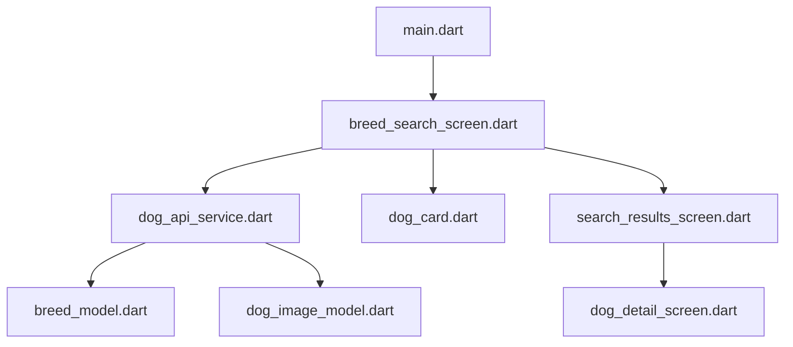

# 📚 Documentación de la Arquitectura: Feature-First en Flutter

Este proyecto utiliza un enfoque **Feature-First** (enfocado a características), el cual organiza el código agrupando los archivos por su funcionalidad de negocio (`dog_search`, autenticación, perfil, etc.) en lugar de agruparlos únicamente por su tipo técnico (todos los modelos juntos, todas las pantallas juntas). Esto mejora la escalabilidad, la mantenibilidad y facilita el trabajo en equipo.

---

## 🗂️ Estructura General de Carpetas y sus Funciones

```text
lib/
├── core/                  # Elementos globales compartidos por toda la app
│   ├── constants/         # Constantes globales (ej. URLs de la API, endpoints)
│   └── theme/             # Configuración de diseño, colores y temas visuales
│
├── features/              # Funcionalidades principales de la aplicación
│   └── dog_search/        # Característica central de búsqueda de perros
│       ├── data/          # Capa de datos (manejo de fuentes externas, modelos y servicios)
│       └── presentation/  # Capa visual (pantallas, widgets y gestión de estado)
│
└── main.dart              # Punto de entrada principal de la aplicación Flutter
```

### 1. Carpeta `core/`
Contiene la infraestructura compartida que no pertenece a una sola característica de negocio específica.
*   **`constants/`**: Almacena valores constantes globales, como credenciales o la URL base de TheDogAPI (`api_constants.dart`).
*   **`theme/`**: Define la identidad visual de la aplicación, como la paleta de colores, tipografías y estilos de componentes reutilizables (`app_theme.dart`).

### 2. Carpeta `features/dog_search/`
Agrupa todo lo relacionado exclusivamente con la búsqueda y visualización de razas e imágenes de perros. Se divide internamente en dos capas principales:

#### A. Capa `data/` (Datos y Conexión)
Se encarga de comunicarse con fuentes externas (como la API REST) y transformar la información cruda en objetos utilizables por la app.
*   **`models/`**: 
    *   `breed_model.dart`: Define la estructura de datos (clase) para una raza de perro (nombre, temperamento, origen, imagen, etc.) e incluye métodos como `fromJson` para deserializar las respuestas JSON.
    *   `dog_image_model.dart`: Modela las imágenes asociadas a los perros devueltas por la API.
*   **`services/`**:
    *   `dog_api_service.dart`: Contiene la lógica de red (usando paquetes como `http` o `dio`) para realizar peticiones HTTP hacia TheDogAPI.

#### B. Capa `presentation/` (Interfaz de Usuario)
Contiene todo lo que el usuario ve e interactúa en la pantalla.
*   **`screens/`**: Pantallas completas de la aplicación.
    *   `breed_search_screen.dart`: Pantalla principal donde el usuario busca o filtra razas de perros.
    *   `search_results_screen.dart`: Pantalla que muestra la lista de resultados basados en la búsqueda.
    *   `dog_detail_screen.dart`: Pantalla que muestra los detalles específicos de un perro seleccionado.
*   **`widgets/`**: Componentes visuales reutilizables más pequeños.
    *   `dog_card.dart`: Tarjeta visual para representar a un perro individual.
    *   `empty_state_widget.dart`: Vista que se muestra cuando no hay resultados o datos.
    *   `error_state_widget.dart`: Vista para manejar y mostrar errores de red o excepciones al usuario.

---

## 🔗 Integración de Funciones en los Archivos `.dart`

A continuación, se detalla cómo interactúan los archivos clave dentro de este flujo **Feature-First**:



1.  **`main.dart`**: Inicializa la app y carga el tema global proveniente de `core/theme/app_theme.dart`, estableciendo `breed_search_screen.dart` como la pantalla inicial (`home`).
2.  **`breed_search_screen.dart`**: Llama a las funciones definidas en `dog_api_service.dart` para obtener la lista de razas al iniciar o cuando el usuario escribe en el buscador.
3.  **`dog_api_service.dart`**: Realiza la petición HTTP a la API (utilizando las rutas definidas en `core/constants/api_constants.dart`) y mapea la respuesta JSON utilizando los constructores `fromJson` de `breed_model.dart` y `dog_image_model.dart`.
4.  **`dog_card.dart` y otras vistas**: Reciben los modelos ya procesados para renderizarlos de manera ordenada en la interfaz gráfica (`screens/`).