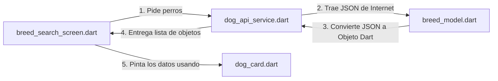

# 🚀 Arquitectura Feature-First (Por Funciones) - Guía Rápida

Para que nadie se complique la vida: **Feature-First** significa que guardamos todo lo relacionado con una pantalla o función de la app en **una sola carpeta** (en lugar de tener los modelos en una esquina del proyecto y las pantallas en otra). 

Si vas a tocar algo de la búsqueda de perros, **todo está dentro de `dog_search`**. ¡Así de fácil!

---

## 📂 ¿Qué hace cada carpeta? (Estructura Simple)

El proyecto se divide en dos grandes bloques dentro de `lib`:

### 1. `core/` (Lo Global)
Aquí va lo que comparte toda la aplicación. No pertenece a ninguna pantalla en específico.
*   **`constants/api_constants.dart`**: Guarda las URLs fijas de internet y los endpoints para conectarse a *TheDogAPI*. (Ej: `static const baseUrl = 'https://api.thedogapi.com/v1';`).
*   **`theme/app_theme.dart`**: Define los colores, fuentes y el diseño visual oscuro/claro de toda la app.

### 2. `features/dog_search/` (La Búsqueda de Perros)
Aquí está el código real del negocio. Se divide en dos capas:

#### 🔹 Capa de Datos (`data/`) — *El motor que trae y procesa la información*
*   **`models/` (Los moldes de datos):**
    *   `breed_model.dart`: El molde que transforma el JSON que manda internet en un objeto de Dart para que lo entienda Flutter (crea la clase `Breed` con su `fromJson`).
    *   `dog_image_model.dart`: El molde para las imágenes de los perros (`DogImage`).
*   **`services/` (Las peticiones a internet):**
    *   `dog_api_service.dart`: El archivo que hace el trabajo sucio. Hace los llamados HTTP (peticiones `GET`) a la API de perros para buscar por nombre o traer fotos.

#### 🔹 Capa de Presentación (`presentation/`) — *Lo que el usuario ve*
*   **`screens/` (Las pantallas completas):**
    *   `breed_search_screen.dart`: El buscador principal con la barra de texto.
    *   `search_results_screen.dart`: La lista con los perritos encontrados.
    *   `dog_detail_screen.dart`: La pantalla que se abre cuando tocas un perro y muestra toda su información (temperamento, origen, peso).
*   **`widgets/` (Los componentes reutilizables):**
    *   `dog_card.dart`: La tarjeta visual (foto + nombre) que se repite en la lista.
    *   `empty_state_widget.dart`: El mensaje que sale cuando buscas algo y no se encuentra nada.
    *   `error_state_widget.dart`: El aviso de "No tienes internet" o "Algo salió mal".

---

## 🔄 ¿Cómo fluyen los datos entre archivos? (Paso a Paso)

Para pintar un perro en la pantalla, el flujo es una línea recta:

1. **El Usuario interactúa:** En `breed_search_screen.dart`, el usuario escribe "Golden".
2. **El Servicio trabaja:** Se llama a la función `searchBreeds("Golden")` de `dog_api_service.dart`.
3. **El Modelo parsea:** La API responde un texto JSON. El servicio usa `Breed.fromJson()` en `breed_model.dart` para convertir ese texto en datos limpios de Flutter.
4. **La Pantalla dibuja:** El servicio le devuelve la lista de perros a la pantalla, la cual los dibuja rápidamente usando tarjetas individuales de `dog_card.dart`. Si algo falla en el camino, se muestra el `error_state_widget.dart`.